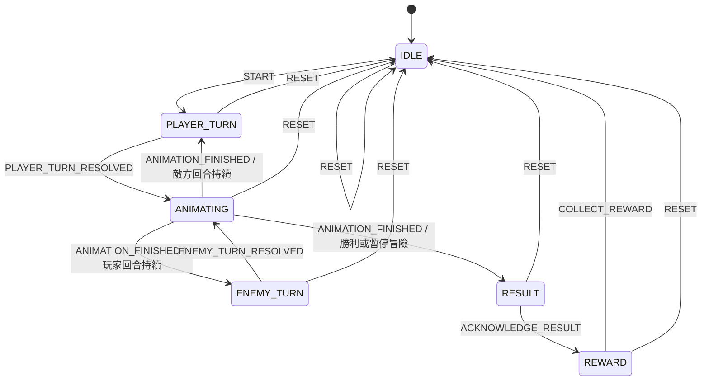

# 回合制答題戰鬥狀態機

`battleState.ts` 是戰鬥流程的唯一狀態邊界。它只處理**階段流轉**，不包含 React、DOM、計時器、動畫或傷害公式。後續的答題判定、連擊與敵人 AI 必須先計算出事件結果，再透過 `dispatch(action)` 請求狀態機變更。

> UI 元件只能呼叫 `BattleDispatcher.dispatch(action)` 與讀取 `getState()`；不可直接修改狀態物件。狀態機回傳的物件已凍結，非法 action 會安全地維持原狀。

| 階段 | 唯一可接受事件 | 目的 |
| --- | --- | --- |
| `IDLE` | `START` | 以真實地圖區域或遭遇資料開始戰鬥。 |
| `PLAYER_TURN` | `PLAYER_TURN_RESOLVED` | 接收答題與攻擊公式完成後的回合結果。 |
| `ANIMATING` | `ANIMATION_FINISHED` | 等待視覺效果結束，避免動畫與回合重疊。 |
| `ENEMY_TURN` | `ENEMY_TURN_RESOLVED` | 接收敵人 AI 計算後的回合結果。 |
| `RESULT` | `ACKNOWLEDGE_RESULT` | 讓學生先閱讀正向結果或安全中斷訊息。 |
| `REWARD` | `COLLECT_REWARD` | 領取由真實完成紀錄計算的獎勵後回到待命。 |

`RESET` 是任何階段可用的安全出口；日後玩家 HP 歸零、離開路由或元件卸載時，應優先派發此事件，並由 UI 取消未完成的動畫與音效。

## 後續串接契約

1. 戰鬥數值模組必須維持純函式，輸入題目結果與敵方資料，輸出 `BattleResolution`。
2. 動畫元件僅在 `ANIMATING` 時播放；完成 callback 必須派發 `ANIMATION_FINISHED`。
3. 地圖與題庫串接只能在 `START` 時傳入實際區域與題目資料，不可填入虛構完成紀錄或獎勵。
