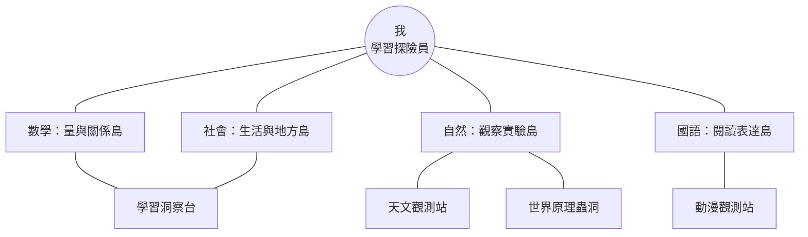

# 我的地圖：知識島嶼與生活連結線設計規格

> **設計目標**：讓學生從「我」出發，看見已經練習過的知識如何連到校園、家庭、社區、自然與科技；地圖只使用此裝置實際存在的作答、收藏與推薦資料，不以正確率高低作為地圖的主要視覺訊號。

## 一、產品定位與體驗原則

「知識島嶼」不是排行榜，也不是能力地圖。它是一張可探索的個人學習關係圖，讓學生先選擇自己想看的學科，再透過「生活連結線」理解概念可以放在哪一種真實情境中。學生可隨時從地圖進入既有的常規試卷、天文館、世界原理、學習洞察或收藏情境；任何沒有作答紀錄的區域都應以「等待你探索」呈現，而不是顯示為不足或落後。

| 設計原則 | 實作規則 | 避免方式 |
|---|---|---|
| 正向且真實 | 僅顯示真實作答數、收藏數、已開啟支架與推薦入口 | 不估算、不補造掌握度或生活經驗 |
| 以學生為中心 | 中央永遠是「我」，知識與生活由中心向外展開 | 不把學生放在被比較的排名座標上 |
| 先關係、後數字 | 島嶼名稱、關係動詞與下一步行動優先於數值 | 不以百分比、紅色警示作為主訊息 |
| 漸進揭露 | 首頁只呈現核心島嶼；點選後才顯示細節卡 | 不讓手機畫面一次塞入全部標籤 |
| 低干擾可退出 | 底部資訊卡、清楚關閉與回到地圖按鈕 | 不使用強制教學彈窗或連續動畫 |

## 二、版面配置

### 2.1 桌面版：環形群島與雙層連結

桌面版使用 12 欄網格，地圖舞台置於頁面主要區域。中央的「我」採 240–280px 圓形主島；四座學科島嶼位於內環四個象限；現有的天文館、世界原理、動漫觀測、夥伴遠征與學習洞察位於外環，作為探索型地標。右側維持 320–360px 的資訊面板，顯示當前選取島嶼或連結線的說明與下一步入口。



| 區域 | 位置與尺寸 | 預設內容 | 點選後內容 |
|---|---|---|---|
| 中央主島「我」 | 舞台中心，直徑約 260px | 學生名稱、等級、完成題數與「今天推薦」摘要 | 顯示今天推薦卡與返回目前練習入口 |
| 四座知識島嶼 | 中央周圍四象限，每座 180–220px | 學科名稱、專屬圖示、真實作答或「開始探索」狀態 | 開啟島嶼資訊面板與生活連結線 |
| 外環探索地標 | 外緣，以較小 112–144px 地標顯示 | 天文館、世界原理、動漫觀測、夥伴、洞察 | 前往現有路由，不改寫既有流程 |
| 生活連結線 | 由選定島嶼向畫面邊緣展開 | 預設淡化，不帶數值 | 點選或聚焦後顯示「概念 → 情境 → 行動」卡 |
| 資訊面板 | 右側固定或 sticky | 一句引導 | 島嶼摘要、真實資料、下一步與關閉控制 |

### 2.2 手機版：中心卡、島嶼軌道與底部抽屜

375px 寬度時，地圖不縮成難以點選的全景。頂部固定顯示「我」中心卡，接著以 2×2 的大型島嶼按鈕呈現四學科；外環探索地標收為可水平滑動的「探索站」列。學生點選島嶼後，生活連結線改為由島嶼卡向下展開的 2–3 張關係卡，底部抽屜顯示說明與行動按鈕。每個主要觸控目標至少 44×44px。

| 手機資訊順序 | 元件 | 行為 |
|---|---|---|
| 1 | 「我」中心卡 | 顯示今天推薦與「查看我的線索」按鈕 |
| 2 | 四座知識島嶼 | 點選一座後設為 `aria-pressed=true`，其餘保持可選 |
| 3 | 生活連結卡 | 只顯示所選島嶼相關的 2–3 條，避免資訊過量 |
| 4 | 探索站列 | 可前往既有天文館、世界原理與觀測站 |
| 5 | 底部抽屜 | 顯示關係說明、收藏入口與下一步練習 |

## 三、知識島嶼定義

四座島嶼使用台灣十二年國教學科語彙，但名稱保持冒險感。色彩只用於區分島嶼，不代表表現好壞；未探索島嶼使用同樣明亮但較低飽和的「等待出發」視覺。

| 島嶼 | 對應領域 | 圖像語彙 | 島嶼開場文案 | 優先串接既有入口 |
|---|---|---|---|---|
| 量與關係島 | 數學 | 比例尺、數線、幾何水晶 | 「把數字、圖形和規律連成可走的路。」 | 常規試卷、學習洞察 |
| 觀察實驗島 | 自然 | 放大鏡、葉片、星軌、實驗瓶 | 「從現象、證據和變化找到線索。」 | 天文館、世界原理、常規試卷 |
| 生活與地方島 | 社會 | 海岸線、校園、社區路牌 | 「看看人、地方和規則如何互相影響。」 | 常規試卷、學習洞察 |
| 閱讀表達島 | 國語 | 書頁、對話框、故事燈塔 | 「從文字裡找線索，也把想法說清楚。」 | 常規試卷、動漫觀測 |

島嶼摘要只能列出以下真實資料：該 `curriculumDomain` 的已作答次數、近期待複習題是否存在、由 `calculateKnowledgeHeatmap()` 得到的實際知識標籤，以及學生自行收藏的相符情境數。若上述資料為空，島嶼顯示「這座島正在等你的第一個線索」與「開始探索」按鈕。

## 四、生活連結線

生活連結線採「概念 → 情境 → 行動」三段式，不宣稱學生已在某種生活情境中做到什麼。每條線都由靜態課綱對應表定義其可能關係，再由實際作答或收藏決定是否顯示「已留下線索」。

| 生活節點 | 關係動詞 | 可由哪座島展開 | 例示內容 | 行動入口 |
|---|---|---|---|---|
| 校園任務 | 我用來安排與觀察 | 量與關係、觀察實驗、閱讀表達 | 時間安排、植物觀察、讀題找關鍵詞 | 開始對應主題練習 |
| 家庭日常 | 我用來比較與說明 | 量與關係、閱讀表達 | 份量比較、步驟說明、閱讀資訊 | 開啟生活情境卡 |
| 社區與台灣 | 我用來理解地方 | 生活與地方、觀察實驗 | 地圖比例、公共規則、環境變化 | 前往相關導讀或試卷 |
| 自然與宇宙 | 我用來提出證據 | 觀察實驗、量與關係 | 星體觀測、能量、季節、紀錄比較 | 前往天文館或世界原理 |
| 科技與創作 | 我用來測試想法 | 量與關係、閱讀表達、觀察實驗 | 資訊判讀、設計步驟、模型與證據 | 前往觀測站或原理引導 |

### 4.1 連結線狀態

| 狀態 | 觸發條件 | 視覺與朗讀文字 | 資料原則 |
|---|---|---|---|
| 等待探索 | 無相符作答與收藏 | 虛線；「這條連結等你用一次練習來發現。」 | 不顯示 0% 或不足訊息 |
| 已留下線索 | 至少一筆相符作答，或一筆學生收藏情境 | 實線加小光點；「你已從這個主題留下探索線索。」 | 只顯示真實題數或收藏數 |
| 今日可延伸 | `getTodayLearningGuide()` 推薦與該島相符 | 淡金色脈衝，低動態模式下改為外框 | 推薦理由直接沿用既有文案 |
| 我的收藏 | 收藏情境 ID 與此連結的課綱映射相符 | 書籤徽章；「你收藏過這個情境。」 | 僅使用 `loadScenarioFavorites()` 回傳 ID |

## 五、學生互動流程

### 流程 A：第一次進入我的地圖

學生進入「我的學習關係圖」後先看到中心卡與一句說明：「從我出發，選一座想探索的知識島。」畫面不自動彈窗。若沒有作答紀錄，中心卡只提示可從今天推薦或任一島嶼開始；若已有真實紀錄，則從既有 `getTodayLearningGuide()` 顯示一個低壓力入口。學生可以直接選島、前往試卷，或離開地圖。

### 流程 B：點選知識島嶼

學生選擇「觀察實驗島」後，島嶼放大 2–4% 並出現右側面板／手機底部抽屜。面板先說明島嶼能幫助學生做什麼，再顯示最多三項真實線索，例如「你已練習過：光與影」或「你收藏了 1 個海洋任務情境」。接著顯示兩條生活連結線，不顯示正確率。學生可選「看生活連結」、「開始一小段練習」或「回到地圖」。

### 流程 C：展開生活連結線

學生點選「自然與宇宙」連結線後，出現一張三段關係卡：第一段為概念標籤，第二段為中性的可能情境，第三段為下一步行動。例如「觀察現象 → 比較天體位置的變化 → 到天文館記錄一個線索」。若學生曾收藏相關情境，卡片另顯示「你的情境筆記」入口；若沒有資料，只顯示「先看一個情境」而非空白或警示。

### 流程 D：回到學習與返回地圖

學生按下行動按鈕時，系統帶著 `source=student-map`、`island=<domain>` 與可選的 `topic=<tag>` 進入既有練習頁。練習完成後，原頁維持既有結果流程；返回我的地圖時重新讀取本機資料，讓新作答自然成為新的「探索線索」。這一步不應自動產生假進度，也不應強制學生回到地圖。

## 六、資料模型與工程對應

前端應建立純函式 `buildKnowledgeIslandSnapshot()`，將既有本機資料轉為僅供視覺化使用的快照，不直接在元件中計算。這有助於測試、空資料降級與未來資料庫遷移。

```ts
type KnowledgeIslandId = "math" | "science" | "social" | "language";

type KnowledgeIslandSnapshot = {
  id: KnowledgeIslandId;
  label: string;
  attemptCount: number;
  observedKnowledge: string[];
  dueReviewCount: number;
  favoriteScenarioCount: number;
  connectionStates: Array<{
    lifeNodeId: "campus" | "home" | "community" | "nature" | "technology";
    state: "waiting" | "discovered" | "recommended" | "saved";
    sourceQuestionIds: string[];
  }>;
};
```

| 現有來源 | 可提供資料 | 知識島嶼用途 | 必須避免 |
|---|---|---|---|
| `loadAdaptiveProfile()` | 作答領域、知識標籤、時間、間隔複習 | 島嶼線索、待複習入口、真實題數 | 將未作答推論為弱項 |
| `calculateKnowledgeHeatmap()` | 已觀測知識標籤與狀態 | 面板中的「已留下線索」標籤 | 在主地圖以紅黃綠做能力評價 |
| `loadScenarioFavorites()` | 學生收藏的題目 ID | 收藏書籤與情境筆記入口 | 顯示未收藏的虛構情境 |
| `getTodayLearningGuide()` | 既有推薦標題、理由與進度預告 | 今日可延伸連結與中心卡 | 新建另一套互相矛盾的推薦邏輯 |
| `loadRpgState()` | 等級、完成題數、夥伴 | 中心卡與冒險敘事 | 以遊戲數值取代學習資料 |

## 七、可近用性、動態與空資料降級

地圖需同時提供「視覺網路」與「線性清單」兩種可達方式。鍵盤使用者按 Tab 可依中心卡、島嶼、探索站、關係卡順序移動；每個島嶼使用原生 `button`，展開狀態以 `aria-pressed` 與 `aria-controls` 說明。SVG 連結線設為 `aria-hidden`，所有關係內容另以可讀文字出現。當使用者啟用 `prefers-reduced-motion` 時，光點、連線流動與島嶼放大改為立即狀態切換。

空資料時，系統顯示一張「從一座島開始」的引導卡，提供常規試卷與天文館兩個入口；不顯示 0%、空圖表或任何負向比較。資料讀取失敗時，保留靜態島嶼名稱與導航入口，並將所有計數安全降為未顯示。

## 八、建議分期實作

| 版本 | 範圍 | 驗收條件 |
|---|---|---|
| V1：知識島嶼 | 中心卡、四座島、真實作答線索、既有入口、手機底部抽屜 | 空資料與有資料都可完成探索及離開流程；無假進度 |
| V2：生活連結線 | 靜態課綱映射、三段關係卡、收藏情境書籤、回到練習 query | 任一島嶼可展開至少兩條連結；各卡可鍵盤操作 |
| V3：探索回流 | `source=student-map` 回傳、今日推薦高亮、策略回顧摘要 | 完成一段練習後回到地圖時只更新真實線索 |
| V4：個人化深化 | 學生選擇「最有幫助的連結」、保存為筆記、教師／家長檢視 | 個人化內容有明確保存與刪除控制，且不形成排名 |

## 九、建議的第一個可開發切片

第一個切片應只做「四座島嶼＋選島資訊抽屜」。它可直接擴充既有 `StudentRelationMap`，不需要改資料庫，也不會改變目前試卷、世界原理、天文館與學習洞察的流程。完成後再加生活連結線，避免在第一版就把視覺、課綱映射、路由與收藏行為全部耦合在一起。

最小驗收包括：學生可在 375px 與桌面選擇任何島嶼；看見不含負向指標的真實學習線索或正向空狀態；從島嶼回到既有學習入口；鍵盤、朗讀與減少動態設定均保持可用。
